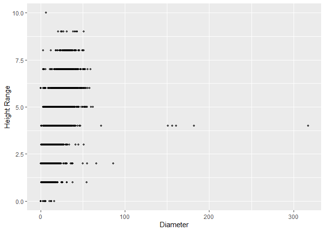
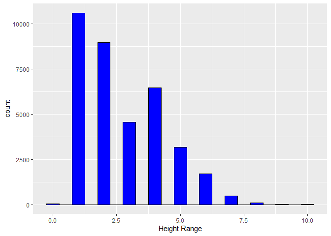
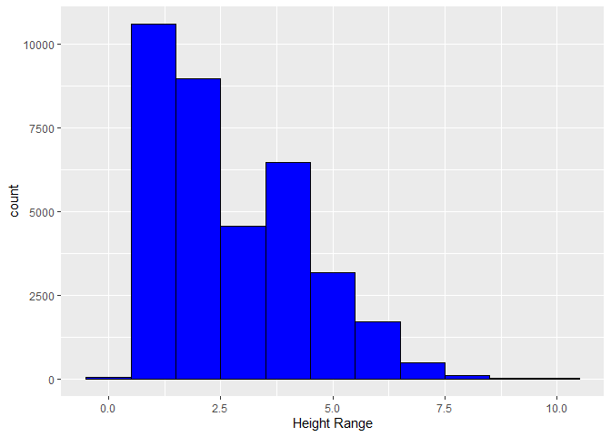
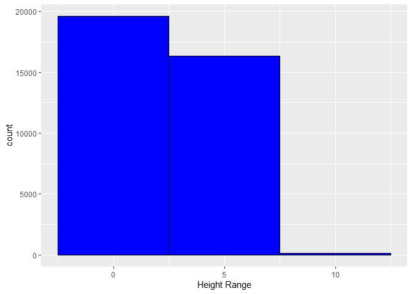
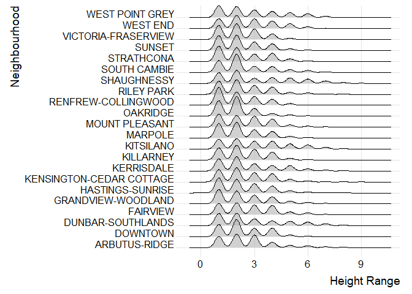
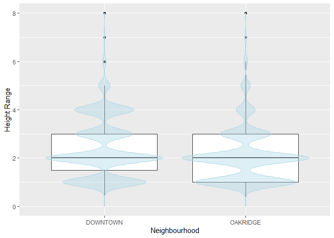
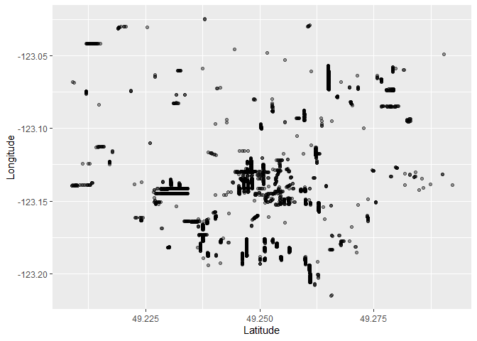

Mini Data Analysis Milestone 2
================

# Introduction

Hello again! This is another R approach to the vancouver_trees
exploratory data analysis from the
[`datateachr`](https://github.com/UBC-MDS/datateachr) package. This time
we will be focusing on summarizing and tidying our data.

This script is based on the [sample data
analysis](https://www.kaggle.com/code/headsortails/tidy-titarnic/report)
that was referenced on the course website.

*To complete this milestone, you can either edit [this `.rmd`
file](https://raw.githubusercontent.com/UBC-STAT/stat545.stat.ubc.ca/master/content/mini-project/mini-project-2.Rmd)
directly. Fill in the sections that are commented out with
`<!--- start your work here--->`. When you are done, make sure to knit
to an `.md` file by changing the output in the YAML header to
`github_document`, before submitting a tagged release on canvas.*

# Welcome to the rest of your mini data analysis project!

In Milestone 1, you explored your data. and came up with research
questions. This time, we will finish up our mini data analysis and
obtain results for your data by:

- Making summary tables and graphs
- Manipulating special data types in R: factors and/or dates and times.
- Fitting a model object to your data, and extract a result.
- Reading and writing data as separate files.

We will also explore more in depth the concept of *tidy data.*

**NOTE**: The main purpose of the mini data analysis is to integrate
what you learn in class in an analysis. Although each milestone provides
a framework for you to conduct your analysis, it’s possible that you
might find the instructions too rigid for your data set. If this is the
case, you may deviate from the instructions – just make sure you’re
demonstrating a wide range of tools and techniques taught in this class.

# Instructions

**To complete this milestone**, edit [this very `.Rmd`
file](https://raw.githubusercontent.com/UBC-STAT/stat545.stat.ubc.ca/master/content/mini-project/mini-project-2.Rmd)
directly. Fill in the sections that are tagged with
`<!--- start your work here--->`.

**To submit this milestone**, make sure to knit this `.Rmd` file to an
`.md` file by changing the YAML output settings from
`output: html_document` to `output: github_document`. Commit and push
all of your work to your mini-analysis GitHub repository, and tag a
release on GitHub. Then, submit a link to your tagged release on canvas.

**Points**: This milestone is worth 50 points: 45 for your analysis, and
5 for overall reproducibility, cleanliness, and coherence of the Github
submission.

**Research Questions**: In Milestone 1, you chose two research questions
to focus on. Wherever realistic, your work in this milestone should
relate to these research questions whenever we ask for justification
behind your work. In the case that some tasks in this milestone don’t
align well with one of your research questions, feel free to discuss
your results in the context of a different research question.

# Learning Objectives

By the end of this milestone, you should:

- Understand what *tidy* data is, and how to create it using `tidyr`.
- Generate a reproducible and clear report using R Markdown.
- Manipulating special data types in R: factors and/or dates and times.
- Fitting a model object to your data, and extract a result.
- Reading and writing data as separate files.

# Setup

Begin by loading your data and the tidyverse package below:

``` r
library(datateachr) # <- might contain the data you picked!
library(tidyverse)
library(ggridges)
```

# Task 1: Process and summarize your data

From milestone 1, you should have an idea of the basic structure of your
dataset (e.g. number of rows and columns, class types, etc.). Here, we
will start investigating your data more in-depth using various data
manipulation functions.

### 1.1 (1 point)

First, write out the 4 research questions you defined in milestone 1
were. This will guide your work through milestone 2:

<!-------------------------- Start your work below ---------------------------->

1.  *What is the height range distribution of the genus with the highest
    number of trees in Vancouver, and how does this relate to diameter?
    \[NEW!!\]*  
    NOTE: I added the second half of this question so that I would be
    able to graph some meaningful data. Otherwise, my answer would have
    only been a single genus name. The second portion of the question
    includes diameter, as that was the major focus of my previous
    milestone project and I wanted to bring it into this one.
2.  *What is the height range distribution of trees in each
    neighbourhood?*
3.  *What is the average height range of trees in Oakridge compared to
    Downtown?*
4.  *What is the geographical distribution of the genus with the largest
    average height range?*
    <!----------------------------------------------------------------------------->

Here, we will investigate your data using various data manipulation and
graphing functions.

### 1.2 (8 points)

Now, for each of your four research questions, choose one task from
options 1-4 (summarizing), and one other task from 4-8 (graphing). You
should have 2 tasks done for each research question (8 total). Make sure
it makes sense to do them! (e.g. don’t use a numerical variables for a
task that needs a categorical variable.). Comment on why each task helps
(or doesn’t!) answer the corresponding research question.

Ensure that the output of each operation is printed!

Also make sure that you’re using dplyr and ggplot2 rather than base R.
Outside of this project, you may find that you prefer using base R
functions for certain tasks, and that’s just fine! But part of this
project is for you to practice the tools we learned in class, which is
dplyr and ggplot2.

**Summarizing:**

1.  Compute the *range*, *mean*, and *two other summary statistics* of
    **one numerical variable** across the groups of **one categorical
    variable** from your data.
2.  Compute the number of observations for at least one of your
    categorical variables. Do not use the function `table()`!
3.  Create a categorical variable with 3 or more groups from an existing
    numerical variable. You can use this new variable in the other
    tasks! *An example: age in years into “child, teen, adult, senior”.*
4.  Compute the proportion and counts in each category of one
    categorical variable across the groups of another categorical
    variable from your data. Do not use the function `table()`!

**Graphing:**

6.  Create a graph of your choosing, make one of the axes logarithmic,
    and format the axes labels so that they are “pretty” or easier to
    read.
7.  Make a graph where it makes sense to customize the alpha
    transparency.

Using variables and/or tables you made in one of the “Summarizing”
tasks:

8.  Create a graph that has at least two geom layers.
9.  Create 3 histograms, with each histogram having different sized
    bins. Pick the “best” one and explain why it is the best.

Make sure it’s clear what research question you are doing each operation
for!

<!------------------------- Start your work below ----------------------------->

#### Question 1: What is the height range distribution of the genus with the highest number of trees in Vancouver, and how does this related to diameter?

``` r
# Compute the number of observations for at least one of your categorical variables.
# In this case I am computing the number of trees in each genera so I can look for the one with the highest number of trees.

num_genera <- vancouver_trees %>%
  group_by(genus_name) %>%
  summarize(count = n())

print(num_genera)
```

    ## # A tibble: 97 × 2
    ##    genus_name  count
    ##    <chr>       <int>
    ##  1 ABIES         190
    ##  2 ACER        36062
    ##  3 AESCULUS     2570
    ##  4 AILANTHUS       4
    ##  5 ALBIZIA         1
    ##  6 ALNUS          74
    ##  7 AMELANCHIER   226
    ##  8 ARALIA          4
    ##  9 ARAUCARIA      10
    ## 10 ARBUTUS        10
    ## # ℹ 87 more rows

``` r
# Find which genus has the highest number of trees in Vancouver 

genus_count <- num_genera %>%
  arrange(desc(count)) %>%
  top_n(1)
```

    ## Selecting by count

``` r
print(genus_count)
```

    ## # A tibble: 1 × 2
    ##   genus_name count
    ##   <chr>      <int>
    ## 1 ACER       36062

``` r
# filter data to include only the genus with the highest number of trees in vancouver
filter_data <- vancouver_trees %>%
  filter(genus_name == genus_count$genus_name)


# graph diameter vs height range id for the trees in the genus with the highest number of trees in vancouver

DvsH_plot <- filter_data %>%
  ggplot(aes(x = diameter, y = height_range_id)) +
  geom_point(alpha = 0.6, size = 1) +
  labs(x = "Diameter", y = "Height Range")

DvsH_plot
```

<!-- -->

``` r
# Create 3 histograms, with each histogram having different sized bins. Pick the "best" one and explain why it is the best.

binsizes <- c(0.5, 1, 5)
height_histograms <- lapply(binsizes, function(binwidth) {
  ggplot(filter_data, aes(x = height_range_id)) + 
    geom_histogram(binwidth = binwidth, 
                   fill = "blue", colour = "black") + 
    labs(x = "Height Range")
})

height_histograms
```

    ## [[1]]

<!-- -->

    ## 
    ## [[2]]

<!-- -->

    ## 
    ## [[3]]

<!-- -->

Answer: The best binsize of these 3 binsizes is 1. The 0.5 binsize is
too small - the bars are so far apart that the graph ends up looking
like a bar graph rather than a histogram. A binsize of 5 is too big -
the data is no longer meaningful when displayed this way because you
cannot see the distribution clearly. A binsize of 1 is best since you
can clearly see the distribution on an appropriate axis.

#### Question 2: What is the height range distribution of trees in each neighbourhood?

``` r
# Compute the number of observations for at least one of your categorical variables.
# In this case I am computing the number of trees in each of the neighbourhoods, so I know how many trees are used to create each height range distribution 

num_nbh <- vancouver_trees %>%
  group_by(neighbourhood_name) %>%
  summarize(count = n())

print(num_nbh)
```

    ## # A tibble: 22 × 2
    ##    neighbourhood_name       count
    ##    <chr>                    <int>
    ##  1 ARBUTUS-RIDGE             5169
    ##  2 DOWNTOWN                  5159
    ##  3 DUNBAR-SOUTHLANDS         9415
    ##  4 FAIRVIEW                  4002
    ##  5 GRANDVIEW-WOODLAND        6703
    ##  6 HASTINGS-SUNRISE         10547
    ##  7 KENSINGTON-CEDAR COTTAGE 11042
    ##  8 KERRISDALE                6936
    ##  9 KILLARNEY                 6148
    ## 10 KITSILANO                 8115
    ## # ℹ 12 more rows

``` r
# Make a graph where it makes sense to customize the alpha transparency.
# for a ridge line plot, there are parts of the distributions that overlap, which is why it makes sense to decrease alpha so your view is not obstructed. 

nbh_plot <- vancouver_trees %>%
  ggplot(aes(x = height_range_id, y = neighbourhood_name)) + 
  geom_density_ridges(alpha = 0.6) +
  labs(x = "Height Range",
       y = "Neighbourhood") +
  theme_ridges()


nbh_plot
```

    ## Picking joint bandwidth of 0.214

<!-- -->

#### Question 3: What is the average height range of trees in Oakridge compared to Downtown?

``` r
# Compute the *range*, *mean*, and *two other summary statistics* of **one numerical variable** across the groups of **one categorical variable** from your data.
# In this case I am computing the summary statistics of the height range id (numerical variable), for the neighbourhoods Oakridge and Downtown (categorical variable; I only focused on a subset of this column due to the nature of my question).

oakridge <- vancouver_trees %>%
  filter(neighbourhood_name == "OAKRIDGE") %>%
  summarize(avg_height = mean(height_range_id),
            max_height = max(height_range_id),
            min_height = min(height_range_id),
            height_range = max_height - min_height)

downtown <- vancouver_trees %>%
  filter(neighbourhood_name == "DOWNTOWN") %>%
  summarize(avg_height = mean(height_range_id),
            max_height = max(height_range_id),
            min_height = min(height_range_id),
            height_range = max_height - min_height)

comparison <- bind_rows(oakridge, downtown)
comparison
```

    ## # A tibble: 2 × 4
    ##   avg_height max_height min_height height_range
    ##        <dbl>      <dbl>      <dbl>        <dbl>
    ## 1       2.14          8          0            8
    ## 2       2.44          8          0            8

``` r
# Create a graph that has at least two geom layers.
# I added an additional layer showing a violin plot on top of the box plot so I could get a better idea of the distribution for height range. 
# ADDITIONAL: Make a graph where it makes sense to customize the alpha transparency.
# since the violin plot is on top of the box plot, it is important to decrease alpha so that you can see the box plot underneath. 

ORvsDT <- vancouver_trees %>%
  filter(neighbourhood_name %in% c("OAKRIDGE", "DOWNTOWN")) %>%
  ggplot(aes(x = neighbourhood_name, y = height_range_id)) +
  geom_boxplot() +
  geom_violin(fill = "lightblue", colour = "lightblue", alpha = 0.4) +
  labs(x = "Neighbourhood", 
       y = "Height Range")

ORvsDT
```

<!-- -->

#### Question 4: What is the geographical range (longitude vs latitude) of the genus with the largest average height range?

Note: At Lucy’s recommendation, I have slightly altered the summary
option since it was a close fit for my question. As this assignment
mentions flexibility, I believe that it should be admissible.

``` r
# Compute the *range*, *mean*, and *two other summary statistics* of **TWO numerical variables** across ONE GROUP of **one categorical variable** from your data.
# The two numerical variables are latitude and longitude 
# The categorical variable is genus_name, and I am looking into the genus ACER specifically
  
latitude_summary <- vancouver_trees %>%
  filter(genus_name == "ACER") %>%
  summarise(range_lat = max(latitude, na.rm = TRUE) - min(latitude, na.rm = TRUE),
            mean_lat = mean(latitude, na.rm = TRUE),
            min_lat = min(latitude, na.rm = TRUE),
            max_lat = max(latitude, na.rm = TRUE))

latitude_summary
```

    ## # A tibble: 1 × 4
    ##   range_lat mean_lat min_lat max_lat
    ##       <dbl>    <dbl>   <dbl>   <dbl>
    ## 1    0.0903     49.2    49.2    49.3

``` r
longitude_summary <- vancouver_trees %>%
  filter(genus_name == "ACER") %>%
  summarise(range_long = max(longitude, na.rm = TRUE) - min(longitude, na.rm = TRUE),
            mean_long = mean(longitude, na.rm = TRUE),
            min_long = min(longitude, na.rm = TRUE),
            max_long = max(longitude, na.rm = TRUE))

longitude_summary
```

    ## # A tibble: 1 × 4
    ##   range_long mean_long min_long max_long
    ##        <dbl>     <dbl>    <dbl>    <dbl>
    ## 1      0.207     -123.    -123.    -123.

``` r
# Make a graph where it makes sense to customize the alpha transparency.
# In a scatterplot, it is good to decrease alpha so that you are able to see the overlap when multiple points aggregate in a specific location. This is very important when looking into distribution. 

genus_avg_height <- vancouver_trees %>%
  group_by(genus_name) %>%
  summarize(avg_height = mean(height_range_id, na.rm = TRUE))

largest_height <- genus_avg_height %>%
  filter(avg_height == max(avg_height)) %>%
  pull(genus_name)

location_scatterplot <- vancouver_trees %>%
  filter(genus_name == largest_height) %>%
  ggplot(aes(x = latitude, y = longitude)) +
  geom_point(alpha = 0.4) +
  labs(x = "Latitude",
       y = "Longitude")
location_scatterplot
```

    ## Warning: Removed 231 rows containing missing values (`geom_point()`).

<!-- -->

<!----------------------------------------------------------------------------->

### 1.3 (2 points)

Based on the operations that you’ve completed, how much closer are you
to answering your research questions? Think about what aspects of your
research questions remain unclear. Can your research questions be
refined, now that you’ve investigated your data a bit more? Which
research questions are yielding interesting results?

<!------------------------- Write your answer here ---------------------------->

For question 1, I was able to find the height distribution of the genus
with the largest population. It may be good in the future to visualize
this using a density plot rather than a histogram for a smoother plot. I
believe it would be interesting to look further into diameter,
specifically whether there are any significant correlations between
height range and diameter in certain genera.

For question 2, I was initially planning on making individual graphs for
the distribution of each neighbourhood (using facet wrap), but I like
how it is much easier to compare them when using a ridge line graph. In
the future it might be good to look into which neighbourhoods have the
tallest trees vs the smallest trees.

For question 3, I included a violin plot on top of the boxplot in order
to visualize the distribution of height ranges. I calculated the mean
value, yet the boxplot visualizes the median. In the future it may be
good to look into median values, so as to not be skewed by outliers.

For question 4, the question was very specific so it was simple to
visualize - in the future I would be interested in the geographical
distribution of *all* the genera across vancouver. It would be
interesting to group them in a scatterplot by colour.

<!----------------------------------------------------------------------------->

# Task 2: Tidy your data

In this task, we will do several exercises to reshape our data. The goal
here is to understand how to do this reshaping with the `tidyr` package.

A reminder of the definition of *tidy* data:

- Each row is an **observation**
- Each column is a **variable**
- Each cell is a **value**

### 2.1 (2 points)

Based on the definition above, can you identify if your data is tidy or
untidy? Go through all your columns, or if you have \>8 variables, just
pick 8, and explain whether the data is untidy or tidy.

<!--------------------------- Start your work below --------------------------->

``` r
head(vancouver_trees)
```

    ## # A tibble: 6 × 20
    ##   tree_id civic_number std_street genus_name species_name cultivar_name  
    ##     <dbl>        <dbl> <chr>      <chr>      <chr>        <chr>          
    ## 1  149556          494 W 58TH AV  ULMUS      AMERICANA    BRANDON        
    ## 2  149563          450 W 58TH AV  ZELKOVA    SERRATA      <NA>           
    ## 3  149579         4994 WINDSOR ST STYRAX     JAPONICA     <NA>           
    ## 4  149590          858 E 39TH AV  FRAXINUS   AMERICANA    AUTUMN APPLAUSE
    ## 5  149604         5032 WINDSOR ST ACER       CAMPESTRE    <NA>           
    ## 6  149616          585 W 61ST AV  PYRUS      CALLERYANA   CHANTICLEER    
    ## # ℹ 14 more variables: common_name <chr>, assigned <chr>, root_barrier <chr>,
    ## #   plant_area <chr>, on_street_block <dbl>, on_street <chr>,
    ## #   neighbourhood_name <chr>, street_side_name <chr>, height_range_id <dbl>,
    ## #   diameter <dbl>, curb <chr>, date_planted <date>, longitude <dbl>,
    ## #   latitude <dbl>

#### Is this data tidy?

Since some of the columns contain string values, some variables have
multiple components (eg. date_planted has the year, month and day it was
planted). In my case, I did not look at date planted, so I would still
consider this data tidy. The question asks us to choose 8 columns, so I
am choosing: a) tree_id - since each individual tree has a unique ID
number b) genus_name - since I looked into genera quite a bit in this
milestone c) species_name - since I looked into species quite a bit in
the previous milestone d) neighbourhood_name - since I looked into this
in both milestones e) height_range - since I analyzed this for this
milestone f) diameter - since I analyzed this for the last milestone g)
longitude - since I analyzed this for question 4 of this milestone h)
latitude - since I analyzed this for question 4 of this milestone

Overall, I would consider that the subset of data I chose to focus on
for milestone 1 and 2 is tidy.

<!----------------------------------------------------------------------------->

### 2.2 (4 points)

**Now, if your data is tidy, untidy it! Then, tidy it back to it’s
original state.**

If your data is untidy, then tidy it! Then, untidy it back to it’s
original state.

Be sure to explain your reasoning for this task. Show us the “before”
and “after”.

<!--------------------------- Start your work below --------------------------->

#### Since my data was tidy, I will by untidying it!

I will be combining the genus and species columns using the `unite`
function. Since I looked into species in milestone 1, and genera in
milestone 2, this would be considered untidy data.

``` r
untidy_trees <- vancouver_trees %>%
  unite("Scientific Name", genus_name, species_name, sep = " ")

head(untidy_trees)
```

    ## # A tibble: 6 × 19
    ##   tree_id civic_number std_street `Scientific Name`  cultivar_name   common_name
    ##     <dbl>        <dbl> <chr>      <chr>              <chr>           <chr>      
    ## 1  149556          494 W 58TH AV  ULMUS AMERICANA    BRANDON         BRANDON ELM
    ## 2  149563          450 W 58TH AV  ZELKOVA SERRATA    <NA>            JAPANESE Z…
    ## 3  149579         4994 WINDSOR ST STYRAX JAPONICA    <NA>            JAPANESE S…
    ## 4  149590          858 E 39TH AV  FRAXINUS AMERICANA AUTUMN APPLAUSE AUTUMN APP…
    ## 5  149604         5032 WINDSOR ST ACER CAMPESTRE     <NA>            HEDGE MAPLE
    ## 6  149616          585 W 61ST AV  PYRUS CALLERYANA   CHANTICLEER     CHANTICLEE…
    ## # ℹ 13 more variables: assigned <chr>, root_barrier <chr>, plant_area <chr>,
    ## #   on_street_block <dbl>, on_street <chr>, neighbourhood_name <chr>,
    ## #   street_side_name <chr>, height_range_id <dbl>, diameter <dbl>, curb <chr>,
    ## #   date_planted <date>, longitude <dbl>, latitude <dbl>

#### Now, I will make it tidy again!

I will be separating the new column “Scientific Name” back into their
original columns “genus_name” and “species_name” using the `separate`
function.

``` r
tidy_trees <- untidy_trees %>%
  separate("Scientific Name", into = c("genus_name", "species_name"), sep = " ")
```

    ## Warning: Expected 2 pieces. Additional pieces discarded in 15041 rows [11, 12, 48, 55,
    ## 58, 59, 60, 248, 249, 257, 258, 259, 260, 261, 314, 315, 316, 317, 405, 408,
    ## ...].

``` r
head(tidy_trees)
```

    ## # A tibble: 6 × 20
    ##   tree_id civic_number std_street genus_name species_name cultivar_name  
    ##     <dbl>        <dbl> <chr>      <chr>      <chr>        <chr>          
    ## 1  149556          494 W 58TH AV  ULMUS      AMERICANA    BRANDON        
    ## 2  149563          450 W 58TH AV  ZELKOVA    SERRATA      <NA>           
    ## 3  149579         4994 WINDSOR ST STYRAX     JAPONICA     <NA>           
    ## 4  149590          858 E 39TH AV  FRAXINUS   AMERICANA    AUTUMN APPLAUSE
    ## 5  149604         5032 WINDSOR ST ACER       CAMPESTRE    <NA>           
    ## 6  149616          585 W 61ST AV  PYRUS      CALLERYANA   CHANTICLEER    
    ## # ℹ 14 more variables: common_name <chr>, assigned <chr>, root_barrier <chr>,
    ## #   plant_area <chr>, on_street_block <dbl>, on_street <chr>,
    ## #   neighbourhood_name <chr>, street_side_name <chr>, height_range_id <dbl>,
    ## #   diameter <dbl>, curb <chr>, date_planted <date>, longitude <dbl>,
    ## #   latitude <dbl>

<!----------------------------------------------------------------------------->

### 2.3 (4 points)

Now, you should be more familiar with your data, and also have made
progress in answering your research questions. Based on your interest,
and your analyses, pick 2 of the 4 research questions to continue your
analysis in the remaining tasks:

<!-------------------------- Start your work below ---------------------------->

1.  *What is the height range distribution of the genus with the highest
    number of trees in Vancouver, and how does this relate to diameter?*

2.  *What is the height range distribution of trees in each
    neighbourhood?*

<!----------------------------------------------------------------------------->

Explain your decision for choosing the above two research questions.

<!--------------------------- Start your work below --------------------------->

For the first question, since I am interested in the relationship
between height range and diameter, I am curious what will happen if I
impose a restriction for trees that have a diameter of over 200 and then
try to find out which genus has the largest height range.

For the second question, after looking at the distributions of height
across neighbourhoods, I became interested in finding out which
neighbourhood has the smallest tree vs the largest tree.

<!----------------------------------------------------------------------------->

Now, try to choose a version of your data that you think will be
appropriate to answer these 2 questions. Use between 4 and 8 functions
that we’ve covered so far (i.e. by filtering, cleaning, tidy’ing,
dropping irrelevant columns, etc.).

(If it makes more sense, then you can make/pick two versions of your
data, one for each research question.)

<!--------------------------- Start your work below --------------------------->

``` r
relevant_info <- vancouver_trees %>%
  select(genus_name, species_name, neighbourhood_name, height_range_id, diameter)

head(relevant_info)
```

    ## # A tibble: 6 × 5
    ##   genus_name species_name neighbourhood_name       height_range_id diameter
    ##   <chr>      <chr>        <chr>                              <dbl>    <dbl>
    ## 1 ULMUS      AMERICANA    MARPOLE                                2       10
    ## 2 ZELKOVA    SERRATA      MARPOLE                                4       10
    ## 3 STYRAX     JAPONICA     KENSINGTON-CEDAR COTTAGE               3        4
    ## 4 FRAXINUS   AMERICANA    KENSINGTON-CEDAR COTTAGE               4       18
    ## 5 ACER       CAMPESTRE    KENSINGTON-CEDAR COTTAGE               2        9
    ## 6 PYRUS      CALLERYANA   MARPOLE                                2        5

``` r
# Question 1:
filtered_trees <- relevant_info %>%
  filter(diameter > 200)

max_height_tree <- filtered_trees %>%
  filter(height_range_id == max(height_range_id))

tallest_genus <- max_height_tree$genus_name

tallest_genus
```

    ## [1] "ACER"

``` r
# Question 2: 
smallest_height <- relevant_info %>%
  summarise(smallest_nbh <- neighbourhood_name[which.min(height_range_id)])

largest_height <- relevant_info %>%
  summarise(largest_nbh = neighbourhood_name[which.max(height_range_id)])

neighbourhood_min_max <- data.frame(smallest_height, largest_height)

colnames(neighbourhood_min_max) <- c("neighbourhood with smallest tree", "neighbourhood with largest tree")

print(neighbourhood_min_max)
```

    ##   neighbourhood with smallest tree neighbourhood with largest tree
    ## 1                DUNBAR-SOUTHLANDS                       KITSILANO

It appears that the genus ACER has the largest height range when we
restrict the diameter to over 200! This is interesting, as Acer is also
the genus with the largest number of trees in this dataset.

For question 2, it seems like the neighbourhood with the smallest tree
is in Dunbar-southlands, while the tallest tree is in Kitsilano.

<!----------------------------------------------------------------------------->

# Task 3: Modelling

## 3.0 (no points)

Pick a research question from 1.2, and pick a variable of interest
(we’ll call it “Y”) that’s relevant to the research question. Indicate
these.

<!-------------------------- Start your work below ---------------------------->

**Research Question**: What is the height range distribution of the
genus with the highest number of trees in Vancouver, and how does this
relate to diameter?

**Variable of interest**: diameter - Based on my answer from Question 1
in 1.2 and Question 1 in 2.3, I hypothesize that a larger diameter will
be correlated with taller trees in the genus with the highest number of
trees in Vancouver.

<!----------------------------------------------------------------------------->

## 3.1 (3 points)

Fit a model or run a hypothesis test that provides insight on this
variable with respect to the research question. Store the model object
as a variable, and print its output to screen. We’ll omit having to
justify your choice, because we don’t expect you to know about model
specifics in STAT 545.

- **Note**: It’s OK if you don’t know how these models/tests work. Here
  are some examples of things you can do here, but the sky’s the limit.

  - You could fit a model that makes predictions on Y using another
    variable, by using the `lm()` function.
  - You could test whether the mean of Y equals 0 using `t.test()`, or
    maybe the mean across two groups are different using `t.test()`, or
    maybe the mean across multiple groups are different using `anova()`
    (you may have to pivot your data for the latter two).
  - You could use `lm()` to test for significance of regression
    coefficients.

<!-------------------------- Start your work below ---------------------------->

Since we previously found out that the genus with the highest number of
trees was ACER in task 1.2, we can plug that in here.

``` r
correl <- lm(height_range_id ~ diameter, data = vancouver_trees[vancouver_trees$genus_name == "ACER",])

print(correl)
```

    ## 
    ## Call:
    ## lm(formula = height_range_id ~ diameter, data = vancouver_trees[vancouver_trees$genus_name == 
    ##     "ACER", ])
    ## 
    ## Coefficients:
    ## (Intercept)     diameter  
    ##      1.1230       0.1511

``` r
correl_summary <- summary(correl)
correl_summary
```

    ## 
    ## Call:
    ## lm(formula = height_range_id ~ diameter, data = vancouver_trees[vancouver_trees$genus_name == 
    ##     "ACER", ])
    ## 
    ## Residuals:
    ##     Min      1Q  Median      3Q     Max 
    ## -45.013  -0.576  -0.087   0.460   7.933 
    ## 
    ## Coefficients:
    ##              Estimate Std. Error t value Pr(>|t|)    
    ## (Intercept) 1.1229856  0.0076371   147.0   <2e-16 ***
    ## diameter    0.1510727  0.0005551   272.2   <2e-16 ***
    ## ---
    ## Signif. codes:  0 '***' 0.001 '**' 0.01 '*' 0.05 '.' 0.1 ' ' 1
    ## 
    ## Residual standard error: 0.9237 on 36060 degrees of freedom
    ## Multiple R-squared:  0.6726, Adjusted R-squared:  0.6726 
    ## F-statistic: 7.407e+04 on 1 and 36060 DF,  p-value: < 2.2e-16

<!----------------------------------------------------------------------------->

## 3.2 (3 points)

Produce something relevant from your fitted model: either predictions on
Y, or a single value like a regression coefficient or a p-value.

- Be sure to indicate in writing what you chose to produce.
- Your code should either output a tibble (in which case you should
  indicate the column that contains the thing you’re looking for), or
  the thing you’re looking for itself.
- Obtain your results using the `broom` package if possible. If your
  model is not compatible with the broom function you’re needing, then
  you can obtain your results by some other means, but first indicate
  which broom function is not compatible.

<!-------------------------- Start your work below ---------------------------->

``` r
library(broom)

tidy_result <- tidy(correl)

p_val <- tidy_result %>%
  filter(term == "diameter") %>%
  select(p.value)

print(p_val)
```

    ## # A tibble: 1 × 1
    ##   p.value
    ##     <dbl>
    ## 1       0

Clearly, this is significant! Note: the p-value was rounded to zero
because it is so small! The actual value can be found in the printed
model (\<2e-16 \*\*\*)
<!----------------------------------------------------------------------------->

# Task 4: Reading and writing data

Get set up for this exercise by making a folder called `output` in the
top level of your project folder / repository. You’ll be saving things
there.

## 4.1 (3 points)

Take a summary table that you made from Task 1, and write it as a csv
file in your `output` folder. Use the `here::here()` function.

- **Robustness criteria**: You should be able to move your Mini Project
  repository / project folder to some other location on your computer,
  or move this very Rmd file to another location within your project
  repository / folder, and your code should still work.
- **Reproducibility criteria**: You should be able to delete the csv
  file, and remake it simply by knitting this Rmd file.

<!-------------------------- Start your work below ---------------------------->

``` r
library(here)
```

    ## here() starts at C:/Users/jessi/OneDrive/Documents/mda-jchalissery14

``` r
comparison
```

    ## # A tibble: 2 × 4
    ##   avg_height max_height min_height height_range
    ##        <dbl>      <dbl>      <dbl>        <dbl>
    ## 1       2.14          8          0            8
    ## 2       2.44          8          0            8

``` r
write_csv(comparison, file = here("output", "comparison.csv"))
```

<!----------------------------------------------------------------------------->

## 4.2 (3 points)

Write your model object from Task 3 to an R binary file (an RDS), and
load it again. Be sure to save the binary file in your `output` folder.
Use the functions `saveRDS()` and `readRDS()`.

- The same robustness and reproducibility criteria as in 4.1 apply here.

<!-------------------------- Start your work below ---------------------------->

``` r
saveRDS(correl, file = here("output", "correl.rds"))
readRDS("C:/Users/jessi/OneDrive/Documents/mda-jchalissery14/output/correl.rds")
```

    ## 
    ## Call:
    ## lm(formula = height_range_id ~ diameter, data = vancouver_trees[vancouver_trees$genus_name == 
    ##     "ACER", ])
    ## 
    ## Coefficients:
    ## (Intercept)     diameter  
    ##      1.1230       0.1511

<!----------------------------------------------------------------------------->

# Overall Reproducibility/Cleanliness/Coherence Checklist

Here are the criteria we’re looking for.

## Coherence (0.5 points)

The document should read sensibly from top to bottom, with no major
continuity errors.

The README file should still satisfy the criteria from the last
milestone, i.e. it has been updated to match the changes to the
repository made in this milestone.

## File and folder structure (1 points)

You should have at least three folders in the top level of your
repository: one for each milestone, and one output folder. If there are
any other folders, these are explained in the main README.

Each milestone document is contained in its respective folder, and
nowhere else.

Every level-1 folder (that is, the ones stored in the top level, like
“Milestone1” and “output”) has a `README` file, explaining in a sentence
or two what is in the folder, in plain language (it’s enough to say
something like “This folder contains the source for Milestone 1”).

## Output (1 point)

All output is recent and relevant:

- All Rmd files have been `knit`ted to their output md files.
- All knitted md files are viewable without errors on Github. Examples
  of errors: Missing plots, “Sorry about that, but we can’t show files
  that are this big right now” messages, error messages from broken R
  code
- All of these output files are up-to-date – that is, they haven’t
  fallen behind after the source (Rmd) files have been updated.
- There should be no relic output files. For example, if you were
  knitting an Rmd to html, but then changed the output to be only a
  markdown file, then the html file is a relic and should be deleted.

Our recommendation: delete all output files, and re-knit each
milestone’s Rmd file, so that everything is up to date and relevant.

## Tagged release (0.5 point)

You’ve tagged a release for Milestone 2.

### Attribution

Thanks to Victor Yuan for mostly putting this together.
